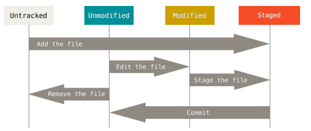

## 基本概念
### Git中文件有三种状态：

+ 已修改（modified）
+ 已暂存（staged）
+ 已提交（committed）

### Git 项目的三个工作区域：

工作目录、暂存区域、Git 仓库（本地仓库/远程仓库）

### 基本的 Git 工作流程如下：
0. 将文件加入追踪 git add
1. 在工作目录中修改文件。
2. 暂存文件，修改过的文件的快照自动放入暂存区域。
3. 提交更新，找到暂存区域的文件，将快照永久性存储到本地Git 仓库的当前分支。Git commit
4. 上传服务器，将本地分支上传到GitHub/远程服务器

## 基本操作
### 创建仓库 并添加文件 上传到GitHub
  Git init #创建git
  Git add toy/*.py #添加文件到track,以后git会追踪你的modify
  Git add ./*.py
  Git add ./*.sh
  git add readme.md

修改文件之后
  
    git status #查看哪些文件处于什么状态：modified untracked
    Git diff #具体查看文件哪里修改(enter下一行 q退出)

现在的暂存区域已经准备妥当可以提交了。 在此之前，请一定要确认还有什么修改过的或新建的文件还没有git add 过，否则提交的时候不会记录这些还没暂存起来的变化。  所以准备提交前，可以先用 git status 看下，是不是都已暂存起来了， 然后再运行提交命令 

----
git commit -m "your commit message e.g.fixed some bugs"
git commit --amend  #想追加注释，ctrl+o 保存 ctrl+x 退出
git reset --soft HEAD^ #执行完commit后，想不删除工作空间改动代码，撤销commit，并且撤销git add
git push http://github.com/xxx/hello.git #上传github
git push -u origin master -f #如果报错强制push
git remote set-url origin http://github.com/GarfieldF/RGBT-tracking.git #如果地址错误，重定向GitHub仓库地址

----

git pull 拉取远端仓库= git fetch git merge #获取你的小伙伴上传的分支，和你的分支合并，如果有冲突手动选择保留哪个版本

git slash 
会把所有未提交的修改（包括暂存的和非暂存的）都保存起来，用于后续恢复当前工作目录。
等到修完Bug，提交到服务器上后，再使用git stash apply将以前的工作恢复回来。

----
## 其他

配置名称和邮箱
 git config --global user.name "GarfieldF"
 git config --global user.email "xxx@163.com"
生成新的密钥
ssh-keygen -t rsa -b 4096 -C "your_email@example.com"加到GitHub里

### 从GitHub克隆仓库
git clone http://github.com/GarfieldF/RGBT-tracking
### 从GitHub下载并添加子模块
git submodule add http://
