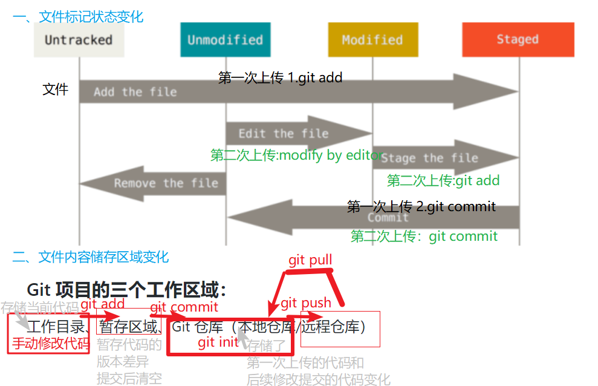

 [参考自官方教程](https://git-scm.com/docs "With a Title"). 

## 基本概念
### Git中文件有三种状态：

+ 已修改（modified）
+ 已暂存（staged）
+ 已提交（committed）

### Git 项目的三个工作区域：

工作目录、暂存区域、Git 仓库（本地仓库/远程仓库）

### 第一次上传 Github 的流程如下：

0.  **在程序所在最上级目录初始化git仓库** ： **git init**（此时文件状态：untracked）

1. **将文件加入追踪并放到暂存（stage）区域** ：**git add**（状态自动变化：untracked ==> staged）

 
   
2. **提交更新** ：将暂存区域的文件存储到本地Git仓库的当前分支（最开始只有一个分支，即主分支:master），所有暂存的文件被保存：**git commit** 

   （文件状态自动变化：staged ==> unmodified,因为此时工作目录下当前文件和最近一次commit记录的文件内容没有差别，文件状态自动变为未修改）

   第一次commit可视化如图：图中圆点代表了仓库记录了一次提交的内容

  

3. **和其他远程服务器分享你的本地仓库**：远程服务器包括：GitHub/其他主机（github可以认为是世界上最大的装有git软件的主机，或者在另一台服务器上安装git并初始化一个仓库，并和你的主机连接到同一个局域网）： **git push**

### 更新版本后上传Github流程如下：

1. 通过文本编辑器修改已加入追踪的文件。（unmodified ==> modified）

2. 将修改的文件放入暂存区:git add （modified ==> staged）

3. 提交更新：将暂存区域的文件存储到本地Git仓库的master分支：git commit （staged ==> unmodified）

  第二次commit如图：实质上这次commit只记录了被更改的部分,不是把整个文件再次备份一遍。

  

4. 上传服务器，将本地仓库上传到GitHub/远程服务器的仓库:git push（实际上不是把整个仓库上传，只上传了比远程服务器上的仓库新增的内容）

多次更新版本后，仓库记录每次提交的版本，最近一次commit称为HEAD，图中的岔路是出现了新的分支，解决冲突和又合并（这里看不懂不重要，继续看详细操作）。

  
 
上面内容本质上就是三个方面:要使用的命令、（命令/人为修改导致的）文件状态的变化、工作区域内容变化，总结如图： 

## 详细操作
#### 创建仓库

    git init #创建本地git仓库
    

#### 将文件加入追踪方法1：正向添加

    git add . #1.1简单粗暴的把所有文件添加追踪，递归地（不利于长久发展）
    
    
文件树如下：    
   ├── backup  
   │   ├── csmlv0.py  
   │   ├── mainv0.py  
   │   └── naive5_train.py  
   ├── learner.py  
   ├── .git  
   ├── memeta.py  
   ├── omniglot  
   │   ├── omniglot.npy  
   │   ├── processed  
   │   └── raw  
   ├── omniglotNShot.py  
   └── test.py 
   
1.2 温和的通过通配符条件添加

    git add toy/*.py #添加toy文件夹下面所有的py类型文件,以后git会追踪你的modify
    git add ./*.py
    git add ./*.sh
    git add readme.md

评价：优点：操作简单。缺点：在后面git status 会一直提示untracked file

#### 将文件加入追踪方法2：反向添加（推荐）

创建.gitignore文件（可下载并参考本教程下的python.gitignore文件，其中给出了三种方式，任选一种自定义修改你需要忽略的文件，之后将python.gitignore文件重命名为.gitignore，放在git init 命令相同的目录下） 

        git add . #添加除了被忽略的之外的所有文件

评价：缺点：需要了解.gitignore文件的规则。优点：在后面git status会忽略这些被忽略的文件的状态

#### 列出目前所有被追踪的文件

    git ls-tree -r master --name-only

### 你目前所需要知道的
----

#### 将修改的文件放入暂存区

    git add -u #将已追踪的修改文件放入暂存区
    git add . #或者选择将所有的文件放入暂存区，包括没有追踪的，不包括gitignore的
      
    git status #查看哪些文件处于什么状态，需要关注的两种：changes not staged for commit(修改但没有放入暂存区)changes to be committed（放入暂存区等待提交）
    git diff #具体查看文件哪里修改(enter下一行 q退出)

目前为止，暂存区域已经准备妥当可以提交了。 在此之前，请一定要确认还有什么修改过的或新建的文件还没有git add 过，否则提交的时候不会记录这些还没暂存（changes not staged for commit）起来的变化。  

所以准备提交前，可以先用 git status 看下，是不是都已经放入暂存区了（changes to be committed）， 然后再运行提交命令。

#### 提交到本地分支

    git commit -m "your commit message e.g.fixed some bugs"
    git commit --amend  #想追加注释，ctrl+o 保存 ctrl+x 退出
    git reset --soft HEAD^ #如果后悔了，执行完commit后，想不删除工作空间改动代码，撤销commit，并且撤销git add
    git show-branch -a #可视化所有提交的版本

#### 将本地分支上传到github

    git push -u origin master -f #第一次通常需要（-u）强制push
    git push http://github.com/xxx/hello.git #正常情况下直接上传github
    git remote set-url origin http://github.com/GarfieldF/RGBT-tracking.git #如果fork别人的仓库，之后想push到自己的仓库，通常提示地址错误，需要重定向到自己的GitHub仓库地址

----
### 团队协作
    git pull #拉取远端仓库= git fetch git merge #获取你的小伙伴上传的分支，和你的分支合并，如果有冲突手动选择保留哪个版本
    
    git slash #会把所有未提交的修改（包括暂存的和非暂存的）都保存起来，用于后续恢复当前工作目录。
    #等到修完Bug，提交到服务器上后，再使用git stash apply将以前的工作恢复回来。

----
### 最终效果

版本回溯：可以回到曾经commit的任意一个版本，或者和任意版本进行比较，回溯哪里被修改。

代码审查：可以记录你/你的小伙伴commit的内容，方便同行/自己代码的审查。

版本同步：解决了多人协作编程的合作问题。

## 其他

### Connecting to GitHub with SSH 

作用：一劳永逸的配置，不再需要每次上传本地仓库都登陆github。

 [可以直接按照官网教程配置](https://help.github.com/en/articles/connecting-to-github-with-ssh "With a Title"). 

1. 配置名称和邮箱

    git config --global user.name "GarfieldF"
    git config --global user.email "xxx@163.com"

2. 生成新的密钥

    ssh-keygen -t rsa -b 4096 -C "your_email@example.com"

添加到你的github账号设置中
GitHub网站  -- 点击右上角你的头像 settings  --  SSH and GPG keys --New SSH key
将你的密钥加进去，以后就不需要登陆了。

### 从GitHub克隆仓库

    git clone http://github.com/GarfieldF/RGBT-tracking

克隆仓库意味着下载了所有版本，如果只想要最近一次的版本可以下载zip，或者下载github上作者的release

### 从GitHub下载并添加子模块

    git submodule add  https://github.com/vlfeat/matconvnet

将别人的项目作为你的工具库调用，既想保留这个库git的功能（git submodule update命令让这个库与github同步更新），又不想让它干扰你的程序的git仓库。例子详见https://github.com/GarfieldF/RGBT-tracking
